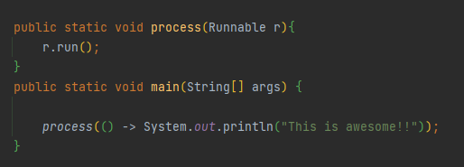

# Chapter 3 : 람다 표현식
### 1. 람다란 무엇인가?
람다 표현식은 메서드로 전달할 수 있는 익명 함수를 단순화한 것이다.
람다 표현식에는 이름은 없지만 파라미터 리스트, 바디, 반환 형식, 발생할 수 있는 예외 리스트는 가질 수 있다. 람다의 특성은 다음과 같다.
- **익명** : 보통의 메서드와 달리 이름이 없으므로 익명이라 표현한다. 구현해야 할 코드에 대해ㅏㄴ 걱정거리가 줄어든다.
- **함수** : 람다는 메서드처럼 틀정 클래스에 종속되지 않으므로 함수라고 부른다. 하지만 메서드처럼 파라미터 리스트, 바디, 반환형식, 가능한 예외 리스트를 포함한다.
- **전달** : 람다 표현식을 메서드 인수로 전달하거나 변수로 지정할 수 있다.
- **간결성** : 익명 클래스처럼 많은 자질구레한 코드를 구현할 필요가 없다.

 
 

### 2. 어디에, 어떻게 람다를 사용할까?
함수형 인터페이스라는 문맥에서 람다 표현식을 사용할 수 있다.

#### 2-1. 함수형 인터페이스
함수형 인터페이스는 정확히 하나의 추상 메서드를 지정하는 인터페이스이다.
(디폴트 메서드가 많이 있더라도, 추상 메서드가 오직 하나면 함수형 인터페이스이다.)

##### 2-2. 함수 디스크립터
함수형 인터페이스의 추상 메서드 시그니처는 람다 표현식의 시그니처를 가리킨다. 람다 표현식의 시그니처를
서술하는 메서드를 함수 디스크립터라고 부른다.  
예를 들어 Runnable 인터페이스는 인수와 반환값이 없는 시그니처로 생각할 수 있다.

## [참고] - 람다와 메소드 호출
아래는 정삭적인 람다 표현식이다.

 
 
### 3. 람다 활용 : 실행 어라운드 패턴
초기화/준비 코드 -> 작업 -> 정리/마무리 코드
 
위와 같은 형식의 코드를 실행 어라운드 패턴이라고 부른다. 예제를 통해 살펴보자.