# Chapter 3 : 람다 표현식
익명 클래스로 다양한 동작을 구현할 수 있지만 만족할 만큼 코드가 깔끔하지는 않았다. 3장에서는
더 깔큼한 코드로 동작을 구현하고 전달하는 자바8의 새로운 기능인 람다 표현식을 설명한다.
    

## 3.1 람다란 무엇인가?
람다 표현식은 메서드로 전달할 수 있는 익명 함수를 '단순화' 한 것이라 생각할 수 있다.
람다 표현식에는 이름은 없지만 파라미터 리스트, 바디, 반환 형식, 발생할 수 있는 예외 리스트는 가질 수 있다. 
람다의 특성은 다음과 같다. 
- 익명 : 보통의 메서드와 달리 이름이 없으므로 익명이라 표현한다. 구현해야 할 코드에 대한 걱정거리가 줄어든다. 
- 함수 : 람다는 메서드처럼 틀정 클래스에 종속되지 않으므로 함수라고 부른다. 하지만 메서드처럼 파라미터 리스트, 바디, 반환형식, 가능한 예외 리스트를 포함한다. 
- 전달 : 람다 표현식을 메서드 인수로 전달하거나 변수로 지정할 수 있다. 
- 간결성 : 익명 클래스처럼 많은 자질구레한 코드를 구현할 필요가 없다.
    

### 람다 표현식은 [파라미터], [화살표], [바디] 세 부분으로 이루어진다
(Apple a1, Apple a2)　  　->　　 a.getWeight().compareTo(a2.getWeight()); 
   └ 람다 파라미터 ┘    　└화살표┘   　　　└───────바디─────────┘

   
## 3.2 어디에, 어떻게 람다를 사용할까?
함수형 인터페이스라는 문맥에서 람다 표현식을 사용할 수 있다.
  
## 3.2.1 함수형 인터페이스
함수형 인터페이스는 정확히 하나의 추상 메서드를 지정하는 인터페이스이다. 
(디폴트 메서드가 많이 있더라도, 추상 메서드가 오직 하나면 함수형 인터페이스이다.)
  
## 3.2.2 함수 디스크립터
함수형 인터페이스의 추상 메서드 시그니처는 람다 표현식의 시그니처를 가리킨다. 람다 표현식의 시그니처를
서술하는 메서드를 함수 디스크립터라고 부른다.  
예를 들어 Runnable 인터페이스는 인수와 반환값이 없는 시그니처로 생각할 수 있다.

 
 

## 3.3 람다 활용 : 실행 어라운드 패턴
초기화/준비 코드 -> 작업 -> 정리/마무리 코드
 
위와 같은 형식의 코드를 실행 어라운드 패턴이라고 부른다.  
예제를 통해 살펴보자.
 

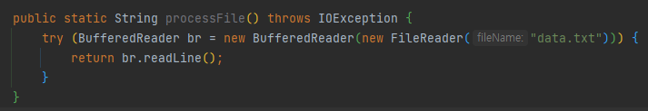

 
 

## 3.3.1, 1단계 : 동작 파라미터화를 기억하라
 
현재 코드는 한 줄의 입력만 받을 수 있다.  
만약 여러 줄을 읽거나, 가장 자주 사용되는 단어를 반환하려면 어떻게 해야할까? 
기존의 설정, 정리 과정은 재사용하고, processFile 메서드만 다른 동작을 수행하도록 명령할 수 있다면 좋을 것이다. 
이는 processFile의 동작을 파라미터화 함으로써 구현할 수 있다. 
   

## [3.3.2, 2단계 : 함수형 인터페이스를 이용해서 동작 전달.](https://github.com/ShinDongHun1/ModernJavaInAction_Code/tree/main/src/chapter3/level2)
함수형 인터페이스 자리에 람다를 사용할 수 있다. 따라서 BufferedReader -> String과 
IOException을 던질 수 있는 시그니처와 일치하는 함수형 인터페이스를 만들어야 한다. 

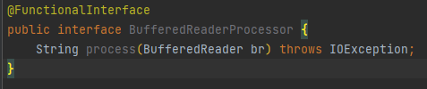
 
 
 
 
## [3.3.3, 3단계 : 동작 실행](https://github.com/ShinDongHun1/ModernJavaInAction_Code/tree/main/src/chapter3/level3)

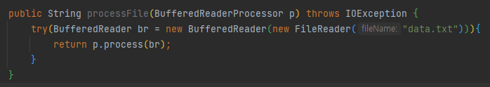

    

## [3.3.4, 4단계 : 람다 전달](https://github.com/ShinDongHun1/ModernJavaInAction_Code/tree/main/src/chapter3/level4)

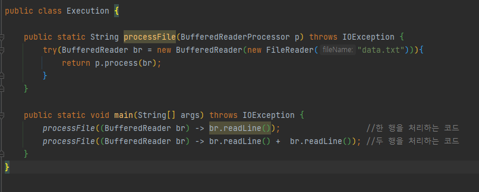
    

지금까지 함수형 인터페이스를 이용해서 람다를 전달하는 방법을 확인했다. 이제 다양한 람다를 전달하는 데 재활용할 수 있도록 자바8에 추가된 새로운 인터페이스를 살펴보자.

    

## [3.4. 함수형 인터페이스 사용](https://github.com/ShinDongHun1/ModernJavaInAction_Code/tree/main/src/chapter3/usefunctionalinterface)
 

## 1. Predicate 
Predicate\<T> 인터페이스는 test라는 추상 메서드를 정의하며 test는 제네릭 형식 T의 객체를
인수로 받아 불리언을 반환한다.
  
[Predicate\<T>: (T) -> boolean]
  

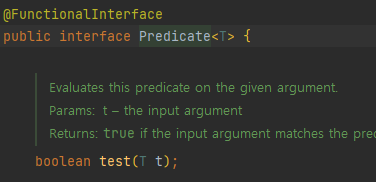  
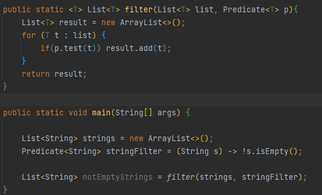  
  
  

## 2. Consumer
Cunsumer\<T> 인터페이스는 제네릭 형식 T 객체를 받아서 void를 반환하는 accept라는 추상 메서드를
정의한다. T 형식의 객체를 받아서 어떤 동작을 수행하고 싶을 때 Consumer 인터페이스를 사용할 수 있다.
  
[Cunsumer\<T>: (T) -> void]
  

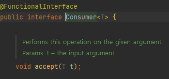  
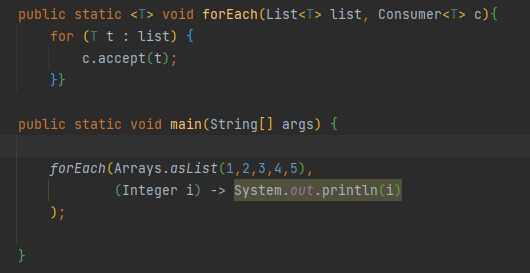  
  

## 3. Function
Function\<T,R> 인터페이스는 제네릭 형식 T를 인수로 받아서 R 객체를 반환하는 추상 메서드 apply를 정의한다.
입력을 출력으로 매핑하는 람다를 정의할 때 Function 인터페이스를 활용할 수 있다.
  
[Function\<T,R>: (T) -> R]
  

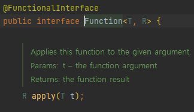  
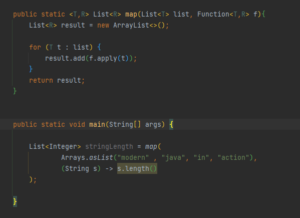  
  

## 기본형 특화
위에서 살펴본 Predicate\<T>, Consumer\<T>, Function\<T,R>은 참조형에 대해서만 사용할 수 있다. 
그 이유는 제네릭 파라미터는 참조형만 사용할 수 있기 때문이다.  
자바에서는 기본형을 참조형으로 변환하는 기능을 제공한다. 
 
이 기능을 박싱이라고 한다. 
참조형을 기본형으로 변환하는 반대 동작을 언박싱이라고 한다. 
 
또한 프로그래머가 편리하게 코드를 구현할 수 있도록 박식과 언박싱이 자동으로 이루어지는 오토박싱이라는 기능도 제공한다. 
하지만 이런 변환 과정은 비용이 소모된다.  
박싱한 값은 기본형을 감싸는 래퍼며, 따라서 힙에 저장된다.(기본형은 스택에 저장된다.)  
결국 박싱한 값은 메모리를 더 소비하며 기본형을 가져올 때도 메모리를 탐색하는 과정이 필요하다. 
 
자바 8에서는 기본형을 입출력으로 사용하는 상황에서 오토박싱 동작을 피할 수 있도록 특별한 버전의 함수형 인터페이스를 제공한다. 
예를 들어 Predicate<Integer>는 int가 들어와도 Integer로 박싱하지만, IntPredicate는 박싱하지 않는다.  
일반적으로 특정 형식을 입력으로 받는 함수형 인터페이스의 이름 앞에는 DoublePredicate, IntCunsumer처럼 형식명이 붙는다.

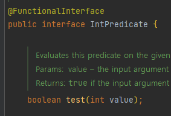
  
    

# 3.5 형식 검사, 형식 추론, 제약
람다 표현식을 처음 설명할 때 람다로 함수형 인터페이스의 인스턴스를 만들 수 있다고 언급했다. 
람다 표현식 자체에는 람다가 어떤 함수형 인터페이스를 구현했는지의 정보가 포함되어 있지 않다. 
따라서 람다 표현식을 더 제대로 이해하려면 람다의 실제 형식을 파악해야 한다.
    

## 3.5.1 형식 검사
람다가 사용되는 Context를 이용해서 람다의 형식을 추론할 수 있다. 어떤 콘텍스트에서 기대되는 람다 표현식의 형식을 '대상 형식' 이라고 부른다 
대상 형식을 만족한다면, 즉 함수 디스크립터를 만족한다면 형식 확인을 완료한다. 
 

## [3.5.2 같은 람다, 다른 함수형 인터페이스](https://github.com/ShinDongHun1/ModernJavaInAction_Code/tree/main/src/chapter3/targettypeing)
'대상 형식'이라는 특징 때문에 같은 람다 표현식이라도 호환되는 추상 메서드를 가진 다른 함수형 인터페이스로 사용될 수 있다.
 
예를 들어 이전에 살펴본 Callable과 PreivilefedAction 인터페이스는 인수를 받지 않고 제네릭 형식 T를 반환하는 함수를 정의한다. 따라서 아래 두 할당문은 유효한 코드이다.

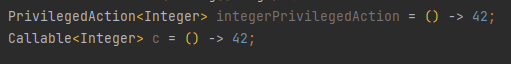  

### [참고] 특별한 void 호환 규칙
람다의 바디에 일반 표현식이 있으면 void를 반환하는 함수 디스크립터와 호환된다. (물론 파라미터 리스트도 호환되어야 한다.) 
예를 들어 다음 두 행에서 List의 add메서드는 Consumer 콘텍스트 (T -> void)가 기대하는 void 대신 boolean을 반환하지만 유효한 코드이다.
 
//Predicate는 불리언 반환값을 갖는다.
Predicate<String> p = s-> list.add(s);

//Consumer는 void 반환값을 갖는다.
Consumer<String> c = s-> list.add(s);

   
## 3.5.3 형식 추론
우리 코드를 좀 더 단순화할 수 있는 방법이 있다. 자바 컴파일러는 람다 표현식이 사용된 콘텍스트(대상 형식)를 이용해서 람다 표현식과 관련된 함수형 인터페이스를 추론한다.
 
즉 대상 형식을 이용해서 함수 디스크립터를 알 수 있으므로 컴파일러는 람다의 시그니처도 추론할 수 있다.
결과적으로 컴파일러는 람다 표현식의 파라미터 형식에 접근할 수 있으므로 람다 문법에서 이를 생략할 수 있다.
 
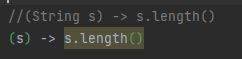  
상황에 따라 명시적으로 선언하는 것이 좋을때도 있고, 생략하는 것이 더 좋을때도 있다.
상황에 따라서 가독성을 향상시키는 방향으로 결정하도록 하자.

   

## [3.5.4 지역 변수 사용](https://github.com/ShinDongHun1/ModernJavaInAction_Code/tree/main/src/chapter3/lambdacapturing)
람다 표현식에서는 자유 변수(외부에서 정의된 변수)를 활용할 수 있는데, 이와 같은 동작을 '람다 캡처링' 이라 부른다. 그러나 자유 변수에도 약간에 제약이 있다. 람다는 인스턴스 변수와 정적 변수를 자유롭게 캡처할 수 있다.
하지만 그러려면 지역 변수는 명시적으로 final로 선언되어 있어야 하거나 실질적으로 final로 선언된 변수와 똑같이 사용되어야 한다.(값이 변하면 안된다는 소리이다.) 

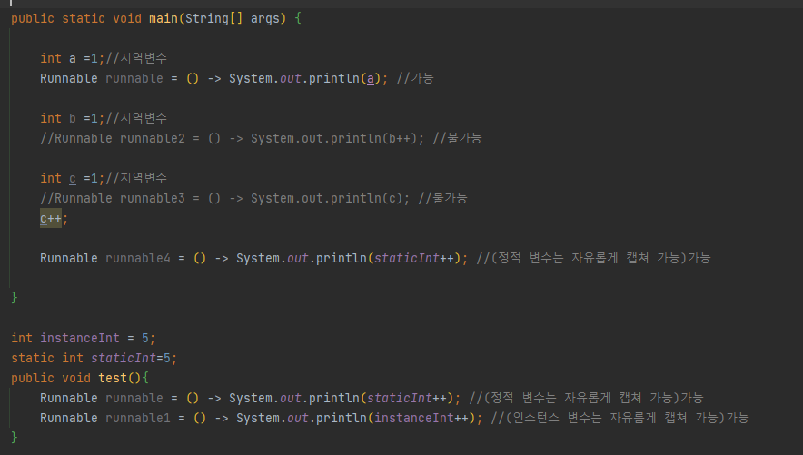  

### 지역 변수의 제약
왜 지역 변수에 이런 제약이 필요할까?  
우선 내부적으로 인스턴스 변수와 지역 변수는 태생부터 다르다. 인스턴스 변수는 힙에 저장되는 반면 지역변수는 스택에 저장된다. 
람다에서 지역변수에 바로 접근할 수 있다는 가정하에 람다가 스레드에서 실행된다면 변수를 할당한 스레드가 사라져서 변수 할당이 해제되었는데도
람다를 실행하는 스레드에서는 해당 변수에 접근하려 할 수 있다. 따라서 자바 구현에서는 원래 변수에 접근을 허용하는 것이 아니라
자유 지역 변수의 복사본을 제공한다. 따라서 복사본의 값이 바뀌지 않아야 하므로 지역 변수에는 한 번만 값을 할당해야 한다는 제약이 생긴 것이다.

## [3.6 메서드 참조](https://github.com/ShinDongHun1/ModernJavaInAction_Code/blob/main/src/chapter3/methodreference/Example.java)
메서드 참조를 이용하면 기존의 메서드 정의를 재활용해서 람다처럼 전달할 수 있다. 때로는 람다 표현식보다 메서드 참조를 사용하는 것이 더 가독성이 좋으며 자연스러울 수 있다.
다음은 메서드 참조와 새로운 자바8 API를 활용한 정렬 예제이다.
 
다음은 기존 코드이다. 
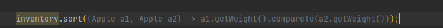  
다음은 메서드 참조의 java.util.Comparator.comparing을 활용한 코드이다 
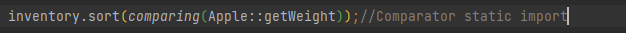  

### 3.6.1 요약
메소드 참조는 특정 메서드만을 호출하는 람다의 축약형이라고 생각할 수 있다.
예를 들어 람다가 '이 메시드를 직접 호출해'라고 명령한다면 메서드를 어떻게 호출해야 하는지 설명을 참조하기보다는 메서드명을 직접 참조하는 것이 편리하다.
실제로 메서드 참조를 이용하면 기존 메서드 구현으로 람다 표현식을 만들 수 있다.
이때 명시적으로 메서드명을 참조함으로써 가독성을 높일 수 있다. 
메서드 참조는 어떻게 활용할까? 메서드면 앞에 구분자(::)를 붙이는 방법으로 메서드 참조를 활용할 수 있다.
예를 들어 Apple.getWeight는 Apple 클래스에 정의된 getWeight의 메서드 참조다. 실제로 메서드를 호출하는 것은 아니므로 괄호는 필요 없음을 기억하자.
결과적으로 메서드 참조는 람다 표현식 (Apple a) -> a.getWeight()를 축약한 것이다.
아래는 자바8에서 사용 가능한 다양한 메서드 참조 예제이다.
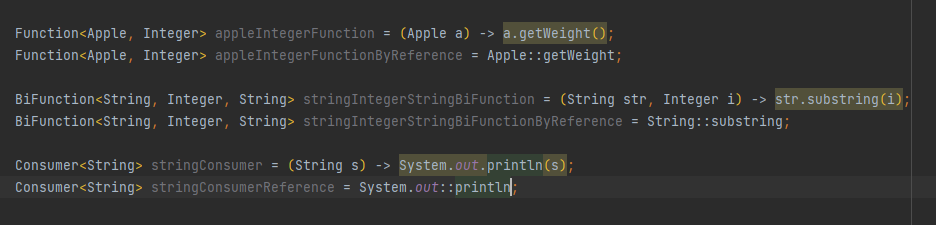  

### 메서드 참조를 만드는 방법
3가지 유형이 있다.

### 1. 정적(static) 메서드 참조
예를 들어 Integer의 parseInt 메서드는 Integer::parseInt로 표현할 수 있다.
  
### 2. 다양한 형식의 인스턴스 메서드 참조
예를 들어 스트링의 length 메서드는 String::length로 표현할 수 있다.
  
### 3. 기존 객체의 인스턴스 메서드 참조
예를 들어 Transaction 객체를 할당받은 expensiveTransaction 지역 변수가 있고, Transaction 객체에는 getValue 메서드가 있다면,
이를 expensiveTransaction::getValue라고 표현할 수 있다.
  
  

### [3.6.2 생성자 참조](https://github.com/ShinDongHun1/ModernJavaInAction_Code/tree/main/src/chapter3/methodreference/ConstructorReference.java)
ClassName::new 처럼 클래스명과 new 키워드를 이용해서 기존 생성자의 참조를 만들 수 있다.
이것은 정적 메서드의 참조를 만드는 방법과 비슷하다.
예를 들어 인수가 없는 생성자, 즉 Supplier의 () -> Apple과 같은 시그니처를 갖는 생성자가 있다고 가정하자.
코드를 통해 설명하겠다. 주석을 참고하자 
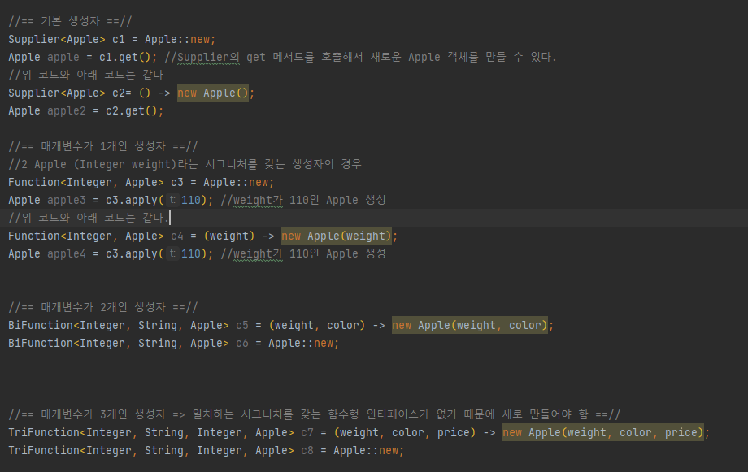  
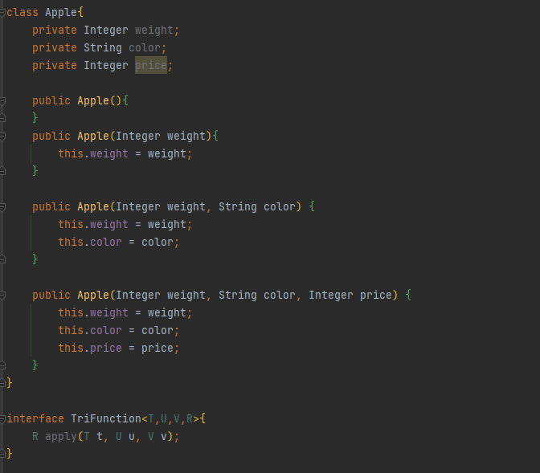  
  

## [3.7 람다, 메서드 참조 활용하기](https://github.com/ShinDongHun1/ModernJavaInAction_Code/tree/main/src/chapter3/methodreference)
이제 처음으로 돌아가서, 사과 리스트를 다양한 정렬 기법으로 정렬하는 코드를 만드는 과정을 보여주면서 3장을 마무리하겠다.
최종 목표는 다음과 같은 코드를 만드는 것이다.  
  

## 3.7.1, 1단계 : 코드 전달하기
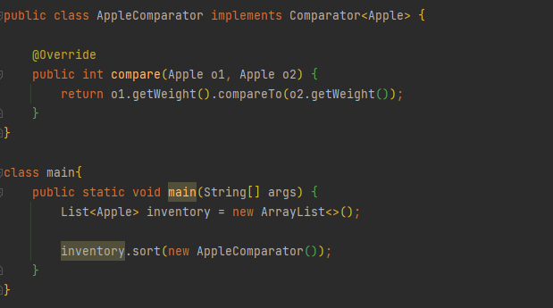  

## 3.7.2, 2단계 : 익명 클래스 사용
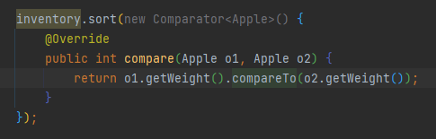  

## 3.7.3, 3단계 : 람다 표현식 사용
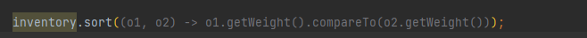  
이 코드의 가독성을 좀 더 좋게 향상시킬 수 없을까? Comparator는 Comparable 키를 추출해서
Comparator 객체로 만드는 Function 함수를 인수로 받는 정적 메서드 comparing을 포함한다. 
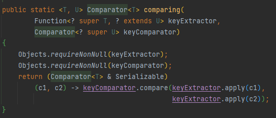
(위와 같이 Function 함수를 갖는다)  
다음처럼 comparing 메서드를 사용할 수 있다. 
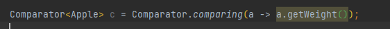
따라서 위를 사용하여 코드를 다음과 같이 간소화 할 수 있다. 
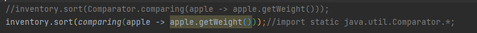  

## 3.7.4, 4단계 : 메서드 참조식 사용
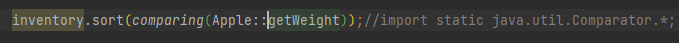  
완성이다. 코드가 짧아졌을 뿐더러 코드의 의미도 좀 더 명확하게 전달된다.
  

## [3.8 람다 표현식을 조합할 수 있는 유용한 메서드](https://github.com/ShinDongHun1/ModernJavaInAction_Code/tree/main/src/chapter3/usefulmethod)
자바 8에서 제공하는 몇몇 함수형 인터페이스는 다양한 유틸리티 메서드를 표현한다.
덕분에 우리는 여러개의 람다 표현식을 조합새허 복잡한 람다 표현식을 만들 수 있다.
이것이 가능한 이유는 자바8에서 제공하는 함수형 인터페이스는 디폴트 메서드를 제공하기 때문이다.
디폴트 메서드는 9장에서 자세히 설명한다. 우선 이 디폴트 메서드를 사용하여 람다 표현식을 조합해보자.
  

## 3.8.1 Comparator 조합
 
위 사진에서 볼 수 있듯이, 정적 메서드 Comparator.comparing을 이용해서 비교에 사용할 키를 추출하는 Function 기반의 Comparator를 반환할 수 있다.
이제 이를 이용하여 한번 다양한 코드를 작성해보자.

### 역정렬
사과의 무게를 내림차순으로 정렬하고 싶다면 어떻게 해야 할까?
다른 Comparator 인스턴스를 만들 필요가 없다. 인터페이스 자체에서 주어진 비교자의 순서를 뒤바구는 reverse라는 디폴트 메서드를 제공하기 때문이다.
따라서 다음과 같이 사용할 수 있다.
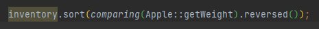  

### Comparator 연결
역정렬은 잘 동작한다. 하지만 무게가 같은 두 사과가 존재한다면 어덯게 할가?
정렬된 리스트에서 어떤 사과를 먼저 나열해야 할까?
이럴 땐 비교 결과를 더 다듬을 수 있는 두번째 Comparator를 만들 수 있다.
예를 들어 무게로 두 사과를 비교한 다음 무게가 같다면 색깔별로 사과를 정렬할 수 있다.
thenComparing 메서드로 두 번째 비교자를 만들 수 있다.
thenComparing은 comparing 메서드처럼 함수를 인수로 받아 첫 번째 비교자를 이용해서 두 객체가 같다고 판단되면
두 번째 비교자에 객체를 전달한다.
즉 다음처럼 문제를 해결할 수 있다.
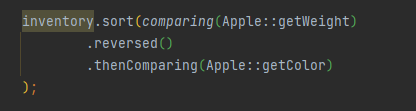  

## 3.8.2 Predicate 조합
Predicate 인터페이스는 복잡한 프레디케이트를 만들 수 있도록 negate, and, or 세 가지의 메서드를 제공한다.
예를 들어 '빨간색이 아닌 사과'처럼 특정 Predicate를 반전시킬 때 negate 메서드를 사용할 수 있다.
예시를 통해 살펴보자
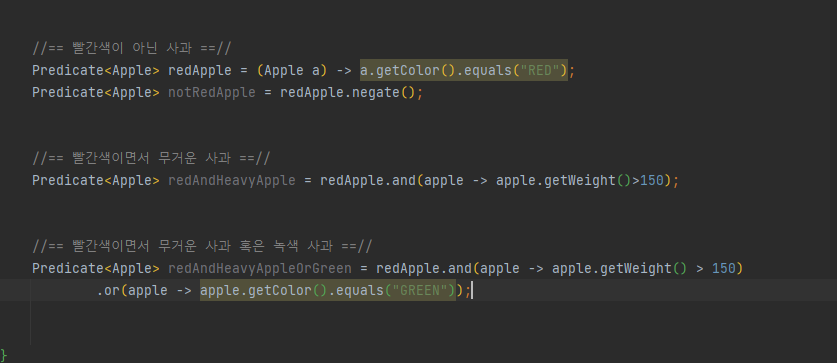  

## 3.8.3 Function
마지막으로 Function 인터페이스에서 제공하는 람다 표현식도 조합할 수 있다. Function 인터페이스는 Function 인스턴스를
반환하는 andThen, compose 두 가지 디폴트 메서드를 제공한다.
andThen 메서드를 주어진 함수를 먼저 적용한 결과를 다음 함수의 입력으로 전달하는 함수를 반환한다.
예를 들어 숫자를 1 증가시키는 f라는 함수가 있고, 숫자에 2를 곱하는 g라는 함수가 있다고 가정하자. 이제 다음처럼
f와 g를 조립해서 숫자를 증가시킨 뒤 결과에 2를 곱하는 함수 h를 만들 수 있다.
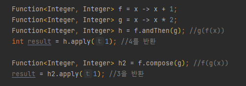  

  
## [3.9 비슷한 수학적 개념](https://github.com/ShinDongHun1/ModernJavaInAction_Code/tree/main/src/chapter3/integrate)
(적분 나와서 도망치려다 그냥 한다.. 수학 싫으면 건너가도 좋다)
다음과 같은 함수가 있다.(자바 함수 말고 수학의 함수) 
f(x) = x + 10 
이를 적분하는 코드를 작성해보자(예시를 위해 x=3~ x=7까지 범위를 적분하는 코드를 작성하겠다) 
우선은 함수 f와 한계값(3과 7)을 인수로 받는 integrate라는 함수를 만들어야 한다.
즉 다음처럼 함수 f를 인수로 받는 함수를 자바로 구현할 수 있다. 
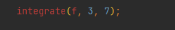  
그러나 다음처럼 간단히 구현할 수는 없다. 
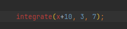  
우선 이 식에서 x의 범위가 불분명하며, f를 전달하는 것이 아니라 x+10이라는 값을 전달하게 되기 때문에 잘못된 식이다.
수학에서 dx의 정체는 'x를 인수로 받아 x+10의 결과를 만드는 함수'로 정리할 수 있다.  

## 3.9.2 자바 8 람다로 연결
이전에 언급했듯이 자바 8에서는 (double x) -> x + 10 같은 람다 표현식을 사용할 수 있다.
따라서 함수 f를 다음처럼 구현할 수 있다. 
integration((double x) -> x + 10, 3, 7)  
또는 다음처럼 구현할 수 있다 
integration((double x) -> f(x), 3, 7)  
이제 integrate 메서드를 어떻게 구현할지 궁금할 것이다.
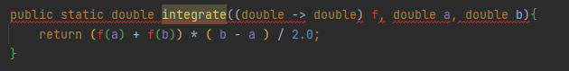  
위는 틀린 코드이다. 람다 표현식은 함수형 인터페이스를 기대하는 콘텍스트에서만 사용할 수 있으므로 다음처럼 구현해야 한다.
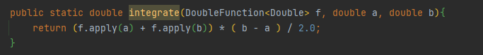  

  
## 3.10 마치며
- 람다 표현식은 익명 함수의 일종이다.
- 람다 표현식으로 간결한 코드를 구현할 수 있다.
- **함수형 인터페이스**는 하나의 추상 메서드만을 정의하는 인터페이스이다.
- 함수형 인터페이스는 하나의 추상 메서드만을 정의하는 인터페이스다.
- 함수형 인터페이스를 기대하는 곳에서만 람다 표현식을 사용할 수 있다.
- 람다 표현식을 이용해서 함수형 인터페이스의 추상 메서드를 즉석으로 제공할 수 있으며, **람다 표현식 전체가 함수형 인터페이스의 인스턴스로 취급된다.**
- java.util.function 패키지는 Predicate\<T>, Function\<T,R> 등을 포함해서 자주 사용하는 다양한 함수형 인터페이스를 제공한다. (자세히 알고싶다면 [이곳을 클릭](https://ttl-blog.tistory.com/207))
- 자바 8은 Predicate\<T> 등과 같은 제네릭 함수형 인터페이스와 관련한 박싱 동작을 피할 수 있는 IntPredicate 같은 기본형 특화 인터페이스도 제공한다.
- 실행 어라운드 패턴 (예를 들면 자원 할당, 자원 정리 등 코드 중간에 실행해야 하는 메서드에 꼭 필요한 코드)을 람다를 활용하면 유연성과 재사용성을 추가로 얻을 수 있다.
- 람다 표현식의 기대 형식을 대상 형식이라고 한다.
- 메서드 참조를 이용하면 기존의 메서드 구현을 재사용하고 직접 전달할 수 있다.
- Comparator, Predicate, Function 같은 함수형 인터페이스는 람다 표현식을 조합할 수 있는 다양한 디폴트 메서드를 제공한다.