# Chapter 3 : 람다 표현식
### 1. 람다란 무엇인가?
람다 표현식은 메서드로 전달할 수 있는 익명 함수를 단순화한 것이다.
람다 표현식에는 이름은 없지만 파라미터 리스트, 바디, 반환 형식, 발생할 수 있는 예외 리스트는 가질 수 있다. 람다의 특성은 다음과 같다.
- **익명** : 보통의 메서드와 달리 이름이 없으므로 익명이라 표현한다. 구현해야 할 코드에 대해ㅏㄴ 걱정거리가 줄어든다.
- **함수** : 람다는 메서드처럼 틀정 클래스에 종속되지 않으므로 함수라고 부른다. 하지만 메서드처럼 파라미터 리스트, 바디, 반환형식, 가능한 예외 리스트를 포함한다.
- **전달** : 람다 표현식을 메서드 인수로 전달하거나 변수로 지정할 수 있다.
- **간결성** : 익명 클래스처럼 많은 자질구레한 코드를 구현할 필요가 없다.

 
 

### 2. 어디에, 어떻게 람다를 사용할까?
함수형 인터페이스라는 문맥에서 람다 표현식을 사용할 수 있다.

#### 2-1. 함수형 인터페이스
함수형 인터페이스는 정확히 하나의 추상 메서드를 지정하는 인터페이스이다.
(디폴트 메서드가 많이 있더라도, 추상 메서드가 오직 하나면 함수형 인터페이스이다.)

##### 2-2. 함수 디스크립터
함수형 인터페이스의 추상 메서드 시그니처는 람다 표현식의 시그니처를 가리킨다. 람다 표현식의 시그니처를
서술하는 메서드를 함수 디스크립터라고 부른다.  
예를 들어 Runnable 인터페이스는 인수와 반환값이 없는 시그니처로 생각할 수 있다.

## [참고] - 람다와 메소드 호출
아래는 정삭적인 람다 표현식이다.
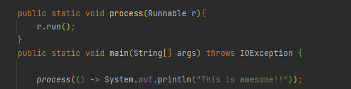
 
 
### 3. 람다 활용 : 실행 어라운드 패턴
초기화/준비 코드 -> 작업 -> 정리/마무리 코드
 
위와 같은 형식의 코드를 실행 어라운드 패턴이라고 부른다.  
예제를 통해 살펴보자.
 

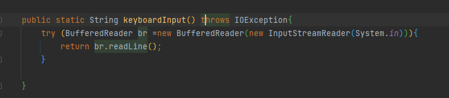
 
 
현재 코드는 한 줄의 입력만 받을 수 있다.  
만약 여러 줄을 읽거나, 가장 자주 사용되는 단어를 반환하려면 어떻게 해야할까?
 
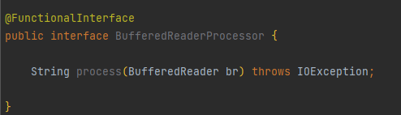  
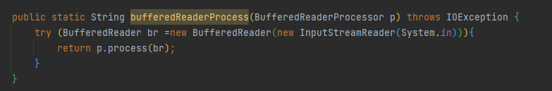  
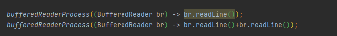  
 
 
 

### 4. 함수형 인터페이스 사용
#### 1. Predicate 
Predicate\<T> 인터페이스는 test라는 추상 메서드를 정의하며 test는 제네릭 형식 T의 객체를
인수로 받아 불리언을 반환한다.

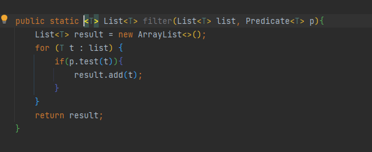  
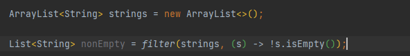  

#### 2. Consumer
Cunsumer\<T> 인터페이스는 제네릭 형식 T 객체를 받아서 void를 반환하는 accept라는 추상 메서드를
정의한다. T 형식의 객체를 받아서 어떤 동작을 수행하고 싶을 때 Consumer 인터페이스를 사용할 수 있다.
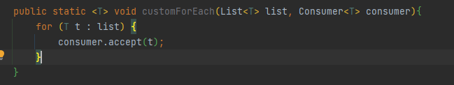  
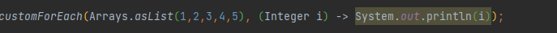  

#### 3. Function
Function\<T,R> 인터페이스는 제네릭 형식 T를 인수로 받아서 R 객체를 반환하는 추상 메서드 apply를 정의한다.
입력을 출력으로 매핑하는 람다를 정의할 때 Function 인터페이스를 활용할 수 있다.
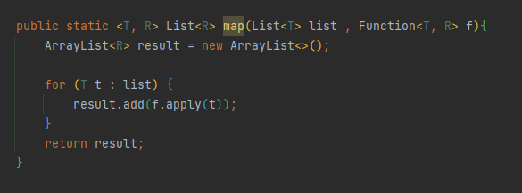  
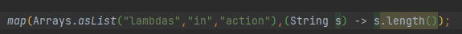  

### 기본형 특화
제네릭 파라미터는 참조형만 사용할 수 있다.  
자바에서는 기본형을 참조형으로 변환하는 기능을 제공한다. 
이 기능을 박싱이라고 한다. 참조형을 기본형으로 변환하는 반대 동작을 언박싱이라고 한다. 
또한 프로그래머가 편리하게 코드를 구현할 수 있도록 박식과 언박싱이 자동으로 이루어지는 오토박싱이라는 기능도 제공한다. 
하지만 이런 변환 과정은 비용이 소모된다. 박싱한 값은 기본형을 감싸는 래퍼며, 따라서 힙에 저장된다. 결국 박싱한 값은
메모리를 더 소비하며 기본형을 가져올 때도 메모리를 탐색하는 과정이 필요하다. 
자바 8에서는 기본형을 입츌력으로 사용하는 상황에서 오토박싱 동작을 피할 수 있도록 특별한 버전의 함수형 인터페이스를 제공한다.
예를 들어 Predicate<Integer>는 int가 들어와도 Integer로 박싱하지만, IntPredicate는 박싱하지 않는다.  
일반적으로 특정 형식을 입력으로 받는 함수형 인터페이스의 이름 앞에는 DoublePredicate, IntCunsumer처럼 형식명이 붙는다.
  

### 형식 추론
자바 컴파일러는 람다 파라미터 형식을 추론할 수 있다. 따라서 명시적으로 형식을 포함해도 되고, 생략해도 된다. 상황에 따라서 가독성을 향상시킬 수 있는 방법으로 정의하자.
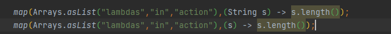  

### 지역 변수 사용
람다 표현식에서는 자유 변수(외부에서 정의된 변수)를 활용할 수 있는데, 이와 같은 동작을 람다 캡처링이라 부른다. 
그러나 자유 변수에도 약간에 제약이 있다. 람다는 인스턴스 변수와 정적 변수를 자유롭게 캡처할 수 있다.
하지만 그러려면 지역 변수는 명시적으로 final로 선언되어 있어야 하거나 실질적으로 final로 선언된 변수와 똑같이 사용되어야 한다.
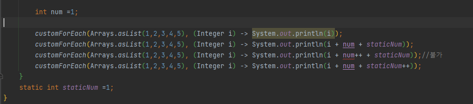  

### 지역 변수의 제약
왜 지역 변수에 이런 제약이 필요할까?  
우선 내부적으로 인스턴스 변수와 지역 변수는 태생부터 다르다. 인스턴스 변수는 힙에 저장되는 반면 지역변수는 스택에 저장된다. 
람다에서 지역변수에 바로 접근할 수 있다는 가정하에 람다가 스레드에서 실행된다면 변수를 할당한 스레드가 사라져서 변수 할당이 해제되었는데도
람다를 실행하는 스레드에서는 해당 변수에 접근하려 할 수 있다. 따라서 자바 구현에서는 원래 변수에 접근을 허용하는 것이 아니라
자유 지역 변수의 복사본을 제공한다. 따라서 복사본의 값이 바뀌지 않아야 하므로 지역 변수에는 한 번만 값을 할당해야 한다는 제약이 생긴 것이다.

