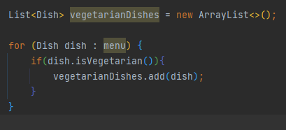
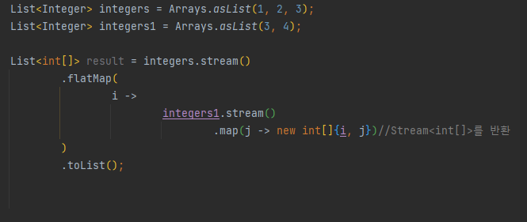

# Chapter 5 : 스트림 활용

   
4장에서는 스트림을 이용해서 외부 반복을 내부 반복으로 바꾸는 방법을 살펴보았다.
다음은 데이터 컬렉션 반복을 명시적으로 관리하는 외부 반복 코드이다. 
  
위처럼 명시적으로 반복하는 대신 filter와 collect 연산을 지원하는 스트림 API를 이용해서 데이터 컬렉션
반복을 내부적으로 처리할 수 있다.
다음은 내부적으로 처리한 코드이다 
  
이제 본격적으로 스트림 API가 지원하는 다양한 연산을 살펴보자.
스트림 API가 지원하는 연산을 이용해서 필터링, 슬라이싱, 매핑, 검색, 매칭, 리듀싱 등 다양한 데이터
처리 질의를 표현할 수 있다.
다음으로 숫자 스트림, 파일과 배열 등 다양한 소스로 스트림을 만드는 방법과, 무한 스트림 등
스트림의 특수한 경우도 살펴본다.

## 5.1 필터링
스트림의 요소를 선택하는 방법, 즉 프레디케이트 필터링 방법과 고유 요소만 필터링하는 방법을 배워보자.

## 5.1.1 프레디케이트로 필터링
스트림 인터페이스는 filter 메서드를 지원한다. filter 메서드는 프레디케이트(불리언을 반환하는 함수)를 
인수로 받아서 프레디케이트와 일치하는 모든 요소를 포함하는 스트림을 반환한다.
예를 들만 다음 코드처럼 채식 메뉴만 필터링 해서 채식 메뉴를 만들 수 있다.
   

## 5.1.2 고유 요소 필터링
스트림은 고유 요소로 이루어진 스트림을 반환하는 distinct 메서드도 지원한다.
(고유 여부는 스트림에서 만든 객체의 **hashCode**, **equals**로 결정된다.)
예를 들어 다음 코드는 리스트의 모든 짝수를 선택하고 중복을 필터링한다.
   

## 5.2 : 스트림 슬라이싱
5.2절에서는 스트림의 요소를 선택하거나 스킵하는 다양한 방법을 설명한다. 프레디케이트를 이용하는 방법,
 스트림의 처음 몇 개의 요소를 무시하는 방법, 특정 크기로 스트림을 줄이는 방법 등 다양한 방법을 이용해 
효율적으로 이런 작업을 수행할 수 있다.
 
 
## 5.2.1 : 프레디케이트를 이용한 슬라이싱
자바 9는 스트림의 요소를 효과적으로 선택할 수 있도록  takeWhile, dropWhile 두 가지 새로운 메서드를 지원한다.

 

## TAKEWHILE 활용
다음과 같은 특별한 요리 목록을 가지고 있다고 가정하자.
   
위 요리 리스트에서 320 칼로리 이하의 요리를 어떻게 선택할 수 있을까?
앞에서 배운 filter를 사용하면 다음과 같이 선택할 수 있다.
   
그러나 위 리스트는 이미 칼로리 순으로 정렬되어 있는 리스트이다.
filter 연산을 이용하면 전체 스트림을 반복하면서 각 요소에 프레디케이트를 적용하게 된다.
 
그런데 리스트가 정렬되어 있으므로, 320칼로리보다 크거나 같은 요리가 나왔을 때 프레디케이드 적용을 멈추면 성능이 더 향상될 것이다.
 
takeWhile 연산을 이용하면 이를 간단하게 처리할 수 있다.
takeWhile을 이용하면 무한 스트림을 포함한 모든 스트림에 프레디케이트를 적용해 스트림을 슬라이스 할 수 있다.
   

## DROPWHILE 활용
dropWhile은 takeWhile과 반대로 프레디케이트가 처음으로 거짓이 되는 지점까지 발견된 요소를 버린다.
즉 위의 예시와 반대로 320칼로리보다 큰 요소를 선택하려면 다음과 같이 dropWhile을 사용할 수 있는 것이다.
   
dropWhile은 프레디케이트가 거짓이 되면 그 지점에서 작업을 중단하고, 지금까지 발견된 요소는 모두 버린 후 남은 모든 요소를 반환한다.
  

## 5.2.2 : 스트림 축소
스트림은 주어진 값 이하의 크기를 갖는 새로운 스트림을 반환하는 limit(n) 메서드를 지원한다.
스트림이 정렬되어 있으면 최대 요소 n개를 반환할 수 있다.
예를 들어 다음처럼 300칼로리 이상의 세 요리를 선택해서 리스트를 만들 수 있다.
   

## 5.2.3 : 요소 건너뛰기
스트림은 처음 n개의 요소를 제외한 스트림을 반환하는 skip(n) 메서드를 지원한다.
n개 이하의 요소를 포함하는 스트림에 skip(n)을 호출하면 빈 스트림이 반환된다.
limit(n)과 skip(n)은 상호 보완적인 연산을 수행한다.
예를 들어 다음 코드는 300칼로리 이상의 처음 두 요리를 건너뛴 다음에 300칼로리가 넘는 나머지 요리를 반환한다.
   

## 5.3 : 매핑
특정 객체에서 특정 데이터를 선택하는 작업은 데이터 처리 과정에서 자주 수행되는 연산이다.
예를 들어 SQL의 테이블에서 특정 열만 선택할 수 있다.
스트림 API의 map과 flatMap 메서드는 특정 데이터를 선택하는 기능을 제공한다.
  

## 5.3.1 : 스트림의 각 요소에 함수 적용하기
스트림은 함수를 인수로 받는 map 메서드를 지원한다.
인수로 제공된 함수는 각 요소에 적용되며 함수를 적용한 결과가 새로운 요소로 매핑된다.
예를 들어 다음은 요리에서 요리명을 추출하는 코드이다.
   

각 요리명의 길이를 알고 싶다면 어떻게 할까? 다음과 같이 할 수 있다.
   

## 5.3.2 : 스트림 평면화
메서드 map을 이용해서 리스트의 각 단어를 반환하는 방법을 확인했다.
이를 응용해서 리스트에서 고유문자로 이루어진 리스트를 반환해보자.
예를 들어 \["Hello", "World"] 리스트가 있다면 결과로 \["H", "e", "l", "o", "W", "r", "d"]
를 포함하는 리스트가 반환되어야 한다.
리스트에 있는 각 단어를 문자로 매핑한 다음에 distinct로 중복된 문자를 필터링해서 해결할 수 있지 않을까? 한번 해보자.
   
결과는 실패한다.
문제는 위 코드에서 map으로 전달한 람다는 각 단어의 String[] (문자열 배열)을 반환한다는 것이 문제이다.
따라서 map 메소드의 반환 결과는 Stream<String[]>이다.
우리가 필요한 것은 Stream<String>이다.
  
이 문제를 해결할 수 있는 것이 바로 flatMap이다.

## flatMap 사용
flatMap을 사용하면 다음처럼 문제를 해결할 수 있다.
   
flatMap을 사용하여 문자열 배열의 스트림에서 문자열 배열의 문자 하나하나 모두 스트림의 컨텐츠로 바꾸어 매핑하였다.
 요약하자면 flatmap은 스트림의 각 값들을 다른 스트림으로 만들 다음에 모든 스트림을 하나의 스트림으로 연결하는 기능을 수행한다.
 
 
## 매핑 복습
다음 문제들을 풀면서 map과 flatmap을 확실히 이해하고 넘어가자
  
문제 1 : 숫자 리스트가 주어졌을 때 각 숫자의 제곱근으로 이루어진 리스트를 반환하시오.
예를 들어 \[1,2,3,4,5]가 주어지면 \[1,4,9,16,25]를 반환해야 한다.
   
문제 2: 두 개의 숫자 리스트가 있을 때 모든 숫자 쌍의 리스트를 반환하시오.
예를 들어 두 개의 리스트 \[1,2,3]과 \[3,4]가 주어지면 \[(1,3), (1,4), (2,3), (2,4), (3,3), (3,4)]를 반환해야 한다.
   

## 5.4 : 검색과 매칭
특정 속성이 데이터 집합에 있는지 여부를 검색하는 데이터 처리도 자주 사용된다.
스트림 API는 allMatch, anyMatch, noneMatch, findFirst, findAny 등 다양한 유틸리티 메서드를 제공한다.