# Chapter 2 : 동작 파라미터화
  

## 예제 코드를 위한 Apple과 Color 생성
 

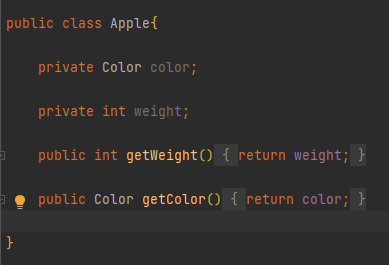  
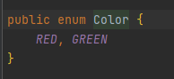
  

  
## [1. 첫 번째 시도 : 녹색 사과 필터링](https://github.com/ShinDongHun1/ModernJavaInAction_Code/tree/main/src/chapter2/attempt1) 
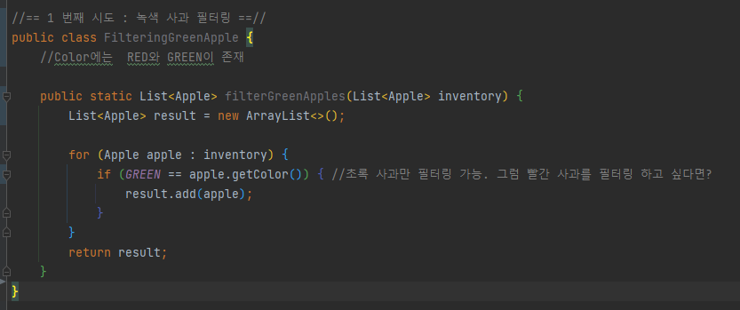

        

## [2. 두 번째 시도 : 색을 파라미터화](https://github.com/ShinDongHun1/ModernJavaInAction_Code/tree/main/src/chapter2/attempt2)
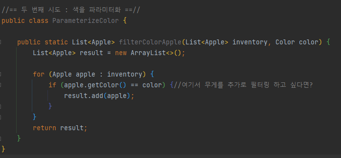

        

## [3. 세 번째 시도 : 가능한 모든 속성으로 필터링 (절대 사용 X)](https://github.com/ShinDongHun1/ModernJavaInAction_Code/tree/main/src/chapter2/attempt3)
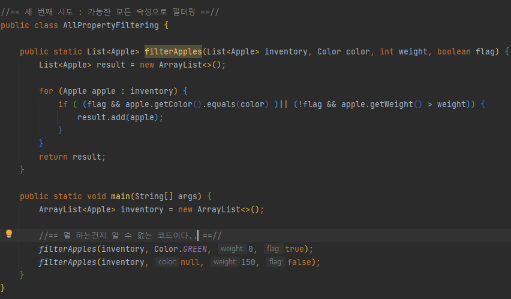

        

## [4. 네 번째 시도 : 추상적 조건으로 필터링(동작 파라미터화)](https://github.com/ShinDongHun1/ModernJavaInAction_Code/tree/main/src/chapter2/attempt4)
  - 참 또는 거짓을 반환하는 함수를 프레디케이트(Predicate)라고 함
  - 사과의 색을 필터링하는 알고리즘을 모아둔 ApplePredicate(인터페이스)와 두 개의 알고리즘 전략(구현)을 설정
  - 메소드에 ApplePredicate의 여러 전략(알고리즘)중 하나를 넘겨서 수행하게 함 -> 전략 패턴(Strategy Pattern)

  
### 인터페이스 정의
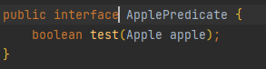  
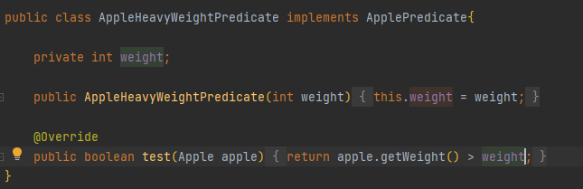  
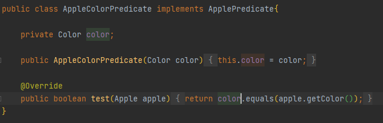  

### 추상적 조건으로 필터링
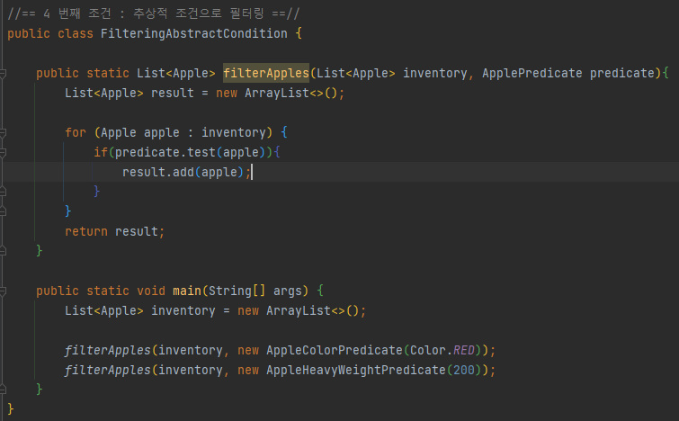

        

## [5. 다섯 번째 시도 : 익명 클래스 사용](https://github.com/ShinDongHun1/ModernJavaInAction_Code/tree/main/src/chapter2/attempt5)
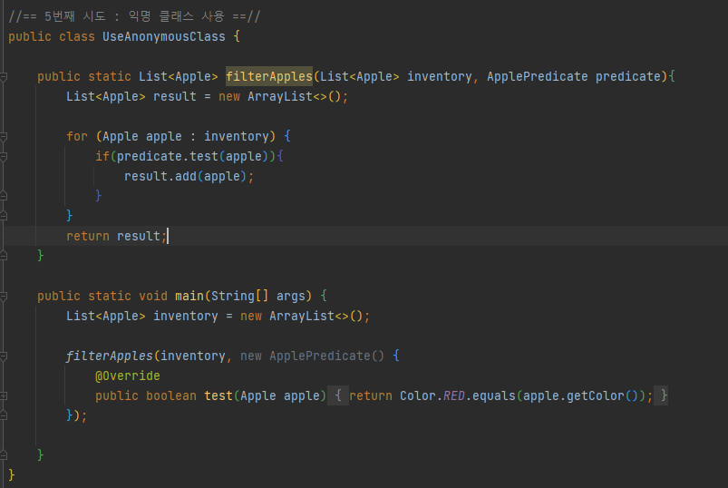
        

## [6. 여섯 번째 시도 : 람다 표현식 사용](https://github.com/ShinDongHun1/ModernJavaInAction_Code/tree/main/src/chapter2/attempt6)
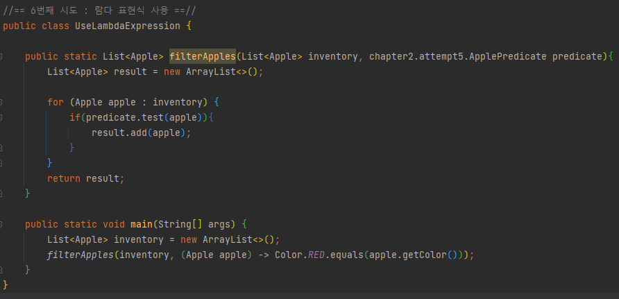
        

## [7. 일곱 번째 시도 : 리스트 형식으로 추상화 (java.util.function의 Predicate 사용)](https://github.com/ShinDongHun1/ModernJavaInAction_Code/tree/main/src/chapter2/attempt7)
  
### Predicate\<T>
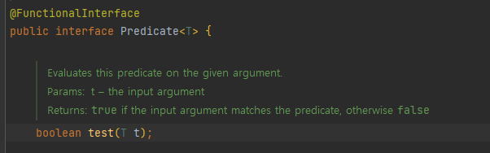
  

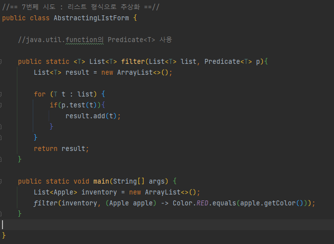
   
   
## 실전 예제

### [Comparator로 정렬하기](https://github.com/ShinDongHun1/ModernJavaInAction_Code/tree/main/src/chapter2/practicalexample/example1)
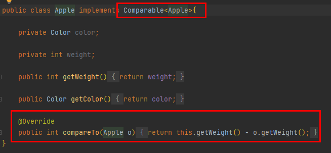
   
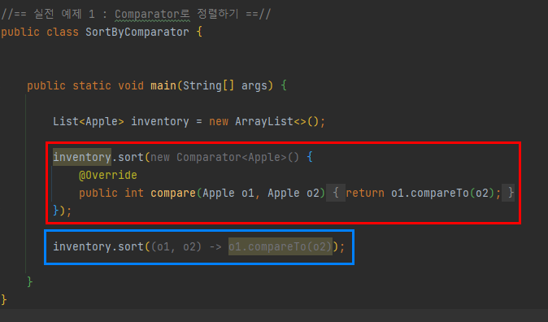
   

### [Runnable로 코드 블록 실행하기.](https://github.com/ShinDongHun1/ModernJavaInAction_Code/tree/main/src/chapter2/practicalexample/example2)
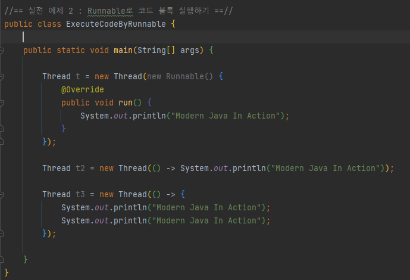
   

### [Callable을 결과로 반환하기](https://github.com/ShinDongHun1/ModernJavaInAction_Code/tree/main/src/chapter2/practicalexample/example3)
  

#### Callable
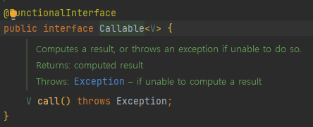
  
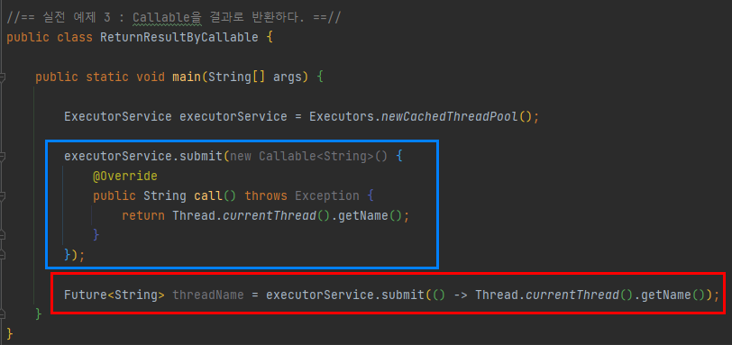