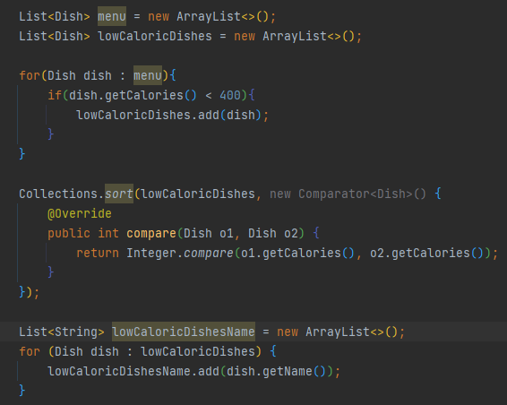
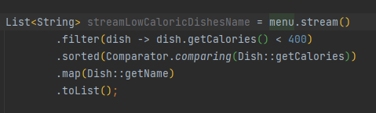
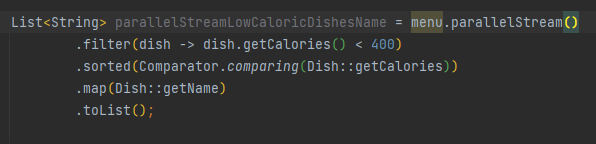
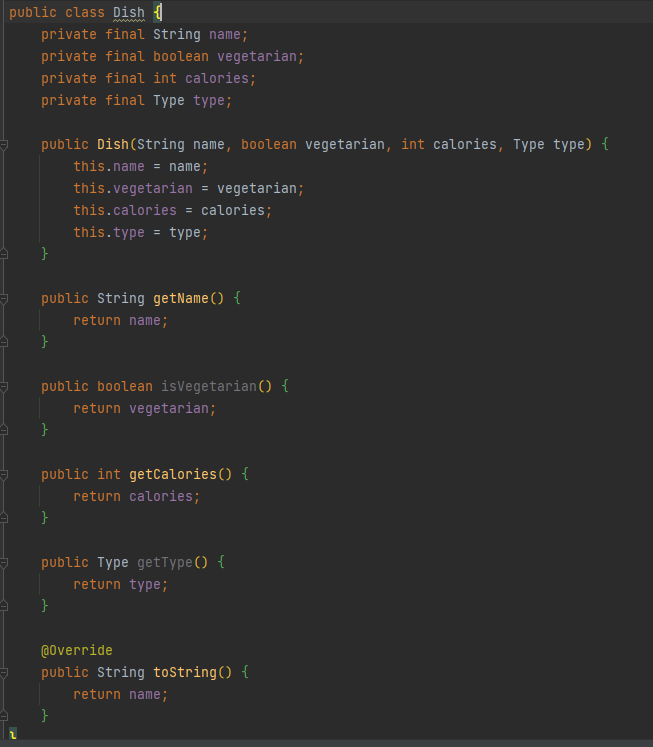
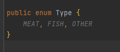
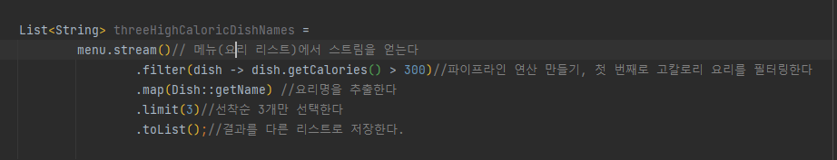

# Chapter 4 : 스트림 소개

## [4.1, 스트림이란 무엇인가](https://github.com/ShinDongHun1/ModernJavaInAction_Code/tree/main/src/chapter4/level1)
스트림을 이용하면 선언형으로 컬렉션 데이터를 처리할 수 있다. 
여기서 '선언형' 이라는 것은 데이터를 처리하는 임시 구현 코드 대신, 질의로 표현할 수 있다는 뜻이다. 
또한 스트림을 이용하면 멀티스레드 코드를 구현하지 않아도 데이터를 투명하게 병렬로 처리할 수 있다.
스트림의 병렬 처리는 이후 Chapter7에서 다루도록 하겠다.
  
우리가 이번 장에서 배울 내용을 미리 알아보자.
다음 코드를 스트림을 이용해서 다시 구현할 것이다.
 
  
다음은 스트림을 사용한 최신 코드이다 
  

stream()을 parallelStream()으로 바꾸면 이 코드를 멀티코어 아키텍처에서 병렬로 실행할 수 있다. 
  
parallelStream에 대해서는 Chapter7에서 자세히 알아보도록 하자.
  
filter, sorted, map, collect 같은 연산은 고수준 빌딩 블록으로 이루어져 있으므로 특정 스레딩 모델에
제한되지 않고 자유롭게 어떤 상황에서든 사용할 수 있다.
(또한 내부적으로 단일 스레드 모델에 사용할 수 있지만, 멀티코어 아키텍처를 최대한 투명하게 활용할 수 있게 구현되어 있다. => 뭔소리인지 모르겠다..ㅠㅠ)
결과적으로 우리는 데이터 처리 과정을 병렬화하면서 스레드와 락을 걱정할 필요가 없다. 이 모든것이 스트림 API 덕분이다.  
자바 8의 스트림 API의 특징을 다음처럼 요약할 수 있다.
- 선언형 : 더 간결하고 가독성이 좋아진다.
- 조립할 수 있슴 : 유연성이 좋아진다.
- 병렬화 : 성능이 좋아진다.

  
[이제 스트림을 본격적으로 알아보기에 앞서, 이후 사용할 요리 예제 코드를 작성하도록 하자](https://github.com/ShinDongHun1/ModernJavaInAction_Code/tree/main/src/chapter4/level1/Dish.java)
 
  
[Type은 다음과 같다.](https://github.com/ShinDongHun1/ModernJavaInAction_Code/tree/main/src/chapter4/level1/Type.java)
 
  

## [4.2, 스트림 시작하기](https://github.com/ShinDongHun1/ModernJavaInAction_Code/tree/main/src/chapter4/level2)
자바 8 컬렉션에서는 스트림을 반환하는 stream 메서드가 추가되었다. 
나중에 살펴보겠지만, 예를 들어 숫자 범위나 I/O 자원에서 스트림 요소를 만드는 등 stream 메서드 이외에도 다양한 방법으로 스트림을 얻을 수 있다.
스트림이란 정학히 뭘까? 스트림이란 '데이터 처리 연산을 지원하도록 소스에서 추출된 연속된 요소'로 정의할 수 있다. 이 정의를 하나씩 살펴보자.
  
- 연속된 요소 : 컬렉션과 마찬가지로 스트림은 특정 요소 형식으로 이루어진 연속된 값집합의 인터페이스를 제공한다.  
컬렉션은 자료구조이므로 컬렉션에서는 시간과 공간의 복잡성과 관련된 요소 저장 및 접근 연산이 주를 이룬다.(예를 들어 ArrayList를 사용할 것인지, LinkedList를 사용할 것인지 등..)
반면 스트림은 filter, sorted, map 처럼 계산식이 주를 이룬다. 즉, 컬렉션의 주제는 데이터고 스트림의 주제는 계산이다.
  
- 소스 : 스트림은 컬렉션, 배열, I/O 자원 등의 데이터 제공 소스로부터 데이터를 소비한다. 
정렬된 컬렉션으로 스트림을 생성하면 정렬이 그대로 유지된다.
즉 리스트로 스트림을 만들면 스트림의 요소는 리스트의 요소와 같은 순서를 유지한다.
  
- 데이터 처리 연산 : 스트림은 함수형 프로그래밍 언어에서 일반적으로 지원하는 연산과 데이터베이스와 비슷한 연산을 지원한다.
예를 들어 filter, map, reduce, find, match, sort 등으로 데이터를 조작할 수 있다. 스트림 연산은 순차적으로 또는 병렬로 실행할 수 있다.
  
    

또한 스트림에는 다음과 같은 두 가지 중요 특징이 있다.

- 파이프라이닝 : 대부분의 스트림 연산은 스트림 연산끼리 연결해서 커다란 파이프라인을 구성할 수 있도록 스트림 자신을 반환한다.
그 덕분에 게으름(laziness), 쇼트서킷(short-circuiting)같은 최적화도 얻을 수 있는데 이는 5장에서 설명하겠다. 
연산 파이프라인은 데이터 소스에 적용하는 데이터베이스 질의와 비슷하다.
    
- 내부 반복 : 반복자를 이용해서 명시적으로 반복하는 컬렉션과 달리 스트림은 내부 반복을 지원한다. 이후 다뤄보겠다.

  
지금까지 설명한 내용을 코드를 보며 확인해보자 
  
우선 요리 리스트를 포함하는 menu에 stream 메서드를 호출해서 스트림을 얻었다.
여기서 데이터 소스는 요리 리스트(menu)이다.
데이터 소스는 연속된 요소를 스트림에 제공한다.
다음으로 스트림에 filter, map, limit, collect로 이어지는 일련의 데이터 처리 연산을 적용한다.
toList를 제외한 모든 연산은 서로 파이프라인을 형성할 수 있도록 스트림을 반환한다.
파이프라인은 소스에 적용하는 질의 같은 존재이다. 마지막으로 toList연산으로 파이프라인을 처리해서 결과를 반환한다.
  
자바 8 이전의 방식으로 구현했을 코드를 상상하면서, 현재 구현한 자바 8의 코드와 비교해보자.
우선 '고칼로리 요리 3개를 찾아라'처럼 좀 더 선언형으로 데이터를 처리할 수 있었다.
스트림 라이브러리에서 필터링, 추출, 축수 기능을 제공하므로 직접 이 기능을 구현할 필요가 없었다.
결과적으로 스트림 API는 파이프라인을 더 최적화할 수 있는 유연성을 제공한다.
예를 들어 필터링, 추출, 축소 각각의 단계를 한 과정으로 합친 다음에 요리 3개를 찾으면 프로그램을 중단시킬 수 있다.
이 과정은 5장에서 설명하겠다.
  
스트림으로 어떤 연산을 수행할 수 있는지 더 자세히 살펴보기 전에, 컬렉션 API와 새로운 스트림 API의 개념적인 차이를 확인하자.

  
    