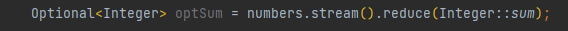
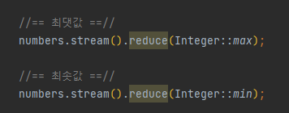
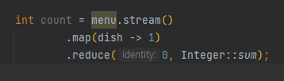
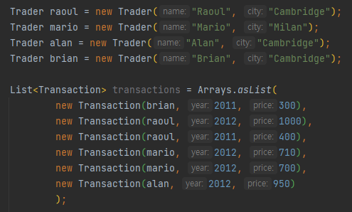

# Chapter 5 : 스트림 활용

   
4장에서는 스트림을 이용해서 외부 반복을 내부 반복으로 바꾸는 방법을 살펴보았다.
다음은 데이터 컬렉션 반복을 명시적으로 관리하는 외부 반복 코드이다. 
  
위처럼 명시적으로 반복하는 대신 filter와 collect 연산을 지원하는 스트림 API를 이용해서 데이터 컬렉션
반복을 내부적으로 처리할 수 있다.
다음은 내부적으로 처리한 코드이다 
  
이제 본격적으로 스트림 API가 지원하는 다양한 연산을 살펴보자.
스트림 API가 지원하는 연산을 이용해서 필터링, 슬라이싱, 매핑, 검색, 매칭, 리듀싱 등 다양한 데이터
처리 질의를 표현할 수 있다.
다음으로 숫자 스트림, 파일과 배열 등 다양한 소스로 스트림을 만드는 방법과, 무한 스트림 등
스트림의 특수한 경우도 살펴본다.

## 5.1 필터링
스트림의 요소를 선택하는 방법, 즉 프레디케이트 필터링 방법과 고유 요소만 필터링하는 방법을 배워보자.

## 5.1.1 프레디케이트로 필터링
스트림 인터페이스는 filter 메서드를 지원한다. filter 메서드는 프레디케이트(불리언을 반환하는 함수)를 
인수로 받아서 프레디케이트와 일치하는 모든 요소를 포함하는 스트림을 반환한다.
예를 들만 다음 코드처럼 채식 메뉴만 필터링 해서 채식 메뉴를 만들 수 있다.
   

## 5.1.2 고유 요소 필터링
스트림은 고유 요소로 이루어진 스트림을 반환하는 distinct 메서드도 지원한다.
(고유 여부는 스트림에서 만든 객체의 **hashCode**, **equals**로 결정된다.)
예를 들어 다음 코드는 리스트의 모든 짝수를 선택하고 중복을 필터링한다.
   

## 5.2 : 스트림 슬라이싱
5.2절에서는 스트림의 요소를 선택하거나 스킵하는 다양한 방법을 설명한다. 프레디케이트를 이용하는 방법,
 스트림의 처음 몇 개의 요소를 무시하는 방법, 특정 크기로 스트림을 줄이는 방법 등 다양한 방법을 이용해 
효율적으로 이런 작업을 수행할 수 있다.
 
 
## 5.2.1 : 프레디케이트를 이용한 슬라이싱
자바 9는 스트림의 요소를 효과적으로 선택할 수 있도록  takeWhile, dropWhile 두 가지 새로운 메서드를 지원한다.

 

## TAKEWHILE 활용
다음과 같은 특별한 요리 목록을 가지고 있다고 가정하자.
   
위 요리 리스트에서 320 칼로리 이하의 요리를 어떻게 선택할 수 있을까?
앞에서 배운 filter를 사용하면 다음과 같이 선택할 수 있다.
   
그러나 위 리스트는 이미 칼로리 순으로 정렬되어 있는 리스트이다.
filter 연산을 이용하면 전체 스트림을 반복하면서 각 요소에 프레디케이트를 적용하게 된다.
 
그런데 리스트가 정렬되어 있으므로, 320칼로리보다 크거나 같은 요리가 나왔을 때 프레디케이드 적용을 멈추면 성능이 더 향상될 것이다.
 
takeWhile 연산을 이용하면 이를 간단하게 처리할 수 있다.
takeWhile을 이용하면 무한 스트림을 포함한 모든 스트림에 프레디케이트를 적용해 스트림을 슬라이스 할 수 있다.
   

## DROPWHILE 활용
dropWhile은 takeWhile과 반대로 프레디케이트가 처음으로 거짓이 되는 지점까지 발견된 요소를 버린다.
즉 위의 예시와 반대로 320칼로리보다 큰 요소를 선택하려면 다음과 같이 dropWhile을 사용할 수 있는 것이다.
   
dropWhile은 프레디케이트가 거짓이 되면 그 지점에서 작업을 중단하고, 지금까지 발견된 요소는 모두 버린 후 남은 모든 요소를 반환한다.
  

## 5.2.2 : 스트림 축소
스트림은 주어진 값 이하의 크기를 갖는 새로운 스트림을 반환하는 limit(n) 메서드를 지원한다.
스트림이 정렬되어 있으면 최대 요소 n개를 반환할 수 있다.
예를 들어 다음처럼 300칼로리 이상의 세 요리를 선택해서 리스트를 만들 수 있다.
   

## 5.2.3 : 요소 건너뛰기
스트림은 처음 n개의 요소를 제외한 스트림을 반환하는 skip(n) 메서드를 지원한다.
n개 이하의 요소를 포함하는 스트림에 skip(n)을 호출하면 빈 스트림이 반환된다.
limit(n)과 skip(n)은 상호 보완적인 연산을 수행한다.
예를 들어 다음 코드는 300칼로리 이상의 처음 두 요리를 건너뛴 다음에 300칼로리가 넘는 나머지 요리를 반환한다.
   

## 5.3 : 매핑
특정 객체에서 특정 데이터를 선택하는 작업은 데이터 처리 과정에서 자주 수행되는 연산이다.
예를 들어 SQL의 테이블에서 특정 열만 선택할 수 있다.
스트림 API의 map과 flatMap 메서드는 특정 데이터를 선택하는 기능을 제공한다.
  

## 5.3.1 : 스트림의 각 요소에 함수 적용하기
스트림은 함수를 인수로 받는 map 메서드를 지원한다.
인수로 제공된 함수는 각 요소에 적용되며 함수를 적용한 결과가 새로운 요소로 매핑된다.
예를 들어 다음은 요리에서 요리명을 추출하는 코드이다.
   

각 요리명의 길이를 알고 싶다면 어떻게 할까? 다음과 같이 할 수 있다.
   

## 5.3.2 : 스트림 평면화
메서드 map을 이용해서 리스트의 각 단어를 반환하는 방법을 확인했다.
이를 응용해서 리스트에서 고유문자로 이루어진 리스트를 반환해보자.
예를 들어 \["Hello", "World"] 리스트가 있다면 결과로 \["H", "e", "l", "o", "W", "r", "d"]
를 포함하는 리스트가 반환되어야 한다.
리스트에 있는 각 단어를 문자로 매핑한 다음에 distinct로 중복된 문자를 필터링해서 해결할 수 있지 않을까? 한번 해보자.
   
결과는 실패한다.
문제는 위 코드에서 map으로 전달한 람다는 각 단어의 String[] (문자열 배열)을 반환한다는 것이 문제이다.
따라서 map 메소드의 반환 결과는 Stream<String[]>이다.
우리가 필요한 것은 Stream<String>이다.
  
이 문제를 해결할 수 있는 것이 바로 flatMap이다.

## flatMap 사용
flatMap을 사용하면 다음처럼 문제를 해결할 수 있다.
   
flatMap을 사용하여 문자열 배열의 스트림에서 문자열 배열의 문자 하나하나 모두 스트림의 컨텐츠로 바꾸어 매핑하였다.
 요약하자면 flatmap은 스트림의 각 값들을 다른 스트림으로 만들 다음에 모든 스트림을 하나의 스트림으로 연결하는 기능을 수행한다.
 
 
## 매핑 복습
다음 문제들을 풀면서 map과 flatmap을 확실히 이해하고 넘어가자
  
문제 1 : 숫자 리스트가 주어졌을 때 각 숫자의 제곱근으로 이루어진 리스트를 반환하시오.
예를 들어 \[1,2,3,4,5]가 주어지면 \[1,4,9,16,25]를 반환해야 한다.
   
문제 2: 두 개의 숫자 리스트가 있을 때 모든 숫자 쌍의 리스트를 반환하시오.
예를 들어 두 개의 리스트 \[1,2,3]과 \[3,4]가 주어지면 \[(1,3), (1,4), (2,3), (2,4), (3,3), (3,4)]를 반환해야 한다.
   

## 5.4 : 검색과 매칭
특정 속성이 데이터 집합에 있는지 여부를 검색하는 데이터 처리도 자주 사용된다.
스트림 API는 allMatch, anyMatch, noneMatch, findFirst, findAny 등 다양한 유틸리티 메서드를 제공한다.
  
## 5.4.1 : 프레디케이트가 적어도 한 요소와 일치하는지 확인
프레디케이트가 주어진 스트림에서 적어도 한 요소와 일치하는지를 확인할 때 anyMatch 메서드를 이용한다.
예를 들어 다음 코드는 menu에 채식요리가 있는지 확인하는 예제이다.
   
anyMatch는 불리언을 반환하므로 최종 연산이다.
  
## 5.4.2 : 프레디케이트가 모든 요소와 일치하는지 검사
allMatch 메서드는 anyMatch와 달리 스트림의 모든 요소가 주어진 프레디케이트와 일치하는지 검사한다.
예를 들어 메뉴가 건강식 (모든 요리가 1000칼로리 이하면 건강식으로 간주) 인지 확인할 수 있다.
   

## NONEMATCH
noneMatch는 allMatch와 반대 연산을 수행한다. 즉, noneMatch는 주어진 프레디케이트와 일치하는 요소가 없는지 확인한다.
예를 들어 이전 예제를 다음처럼 noneMatch로 다시 구현할 수 있다.
   
anyMatch, allMatch, noneMatch 세 메서드는 스트림 **쇼트서킷** 기법, 즉 자바의 &&, ||와 같은 연산을 활용한다.
  
### 쇼트서킷
때로는 전체 스트림을 처리하지 않더라도 결과를 반환할 수 있다. 예를 들어 여러 and 연산으로 연결된 커다란 불리언 
표현식을 평가한다고 가정하자.
표현식에서 하나라도 거짓이라는 결과가 나오면 나머지 표현식의 결과와 상관없이 전체 결과도 거짓이 된다.
이러한 상황을 쇼트서킷이라고 부른다.
allMatch, noneMatch, findFirst, findAny 등의 연산은 모든 스트림의 요소를 처리하지 않고도 결과를 반환할 수 있다.
원하는 요소를 찾았으면 즉시 결과를 반환할 수 있다. 마찬가지로 스트림의 모든 요소를 처리할 필요 없이
주어진 크기의 스트림을 생성하는 limit도 쇼트서킷 연산이다. 특히 무한한 요소를 가진 스트림을 유한한 크기로 줄일 수 있는
유용한 연산이다.
  

## 5.4.3 : 요소 검색
findAny 메서드는 현재 스트림에서 임의의 요소를 반환한다. findAny 메서드를 다른 스트림연산과 연결해서 사용할 수 있다.
예를 들어 다음 코드처럼 filter와 findAny를 이용해서 채식요리를 선택할 수 있다.
   
스트림 파이프라인은 내부적으로 단일 과정으로 실행할 수 있도록 최적화된다. 
즉, 쇼트서킷을 이용해서 결과를 찾는 즉시 실행을 종료한다.
  

## 5.4.4 : 첫 번째 요소 찾기
리스트 또는 정렬된 연속 데이터로부터 생성된 스트림처럼 일부 스트림에는 논리적인 아이템 순서가 정해져 있을 수 있다.
이런 스트림에서 첫 번째 요소를 찾으려면 어떻게 해야 할까? 예를 들어 숫자 리스트에서 3으로 나누어떨어지는 첫 번째 제곱값을 반환하는
다음 코드를 살펴보자.
   
### findFirst와 findAny는 언제 사용하나?
그런데 왜 findFirst와 findAny 메서드가 모두 필요할까? 
바로 병렬성 때문이다.
병렬 실행헤서는 첫 번째 요소를 찾기 어렵다.
따라서 요소의 반환 순서가 상관없다면 병렬 스트림에서는 제약이 적은 findAny를 사용한다.

  
## 5.5 : 리듀싱
지금까지 살펴본 최종 연산은 불리언(allMatch 등), void(forEach), 또는 Optional 객체(findAny 등)를 반환했다.
또란 collect로 모든 스트림의 요소를 리스트로 모으는 방법도 살펴보았다.
 
이 절에서는 리듀스 연산을 이용해서 '메뉴의 모든 칼로리의 합계를 구하시오' , '메뉴에서 칼로리가 가장 높은 요리는?' 같이
스트림 요소를 조합해서 더 복잡한 질의를 표현하는 방법을 설명한다.
이러한 질의를 수행하려면 Integer과 같은 결과가 나올 때까지 스트림의 모든 요소를 반복적으로 처리해야 한다.
이런 질의를 리듀싱 연산(모든 스트림 요소를 처리해서 값으로 도출하는)이라고 한다.
함수형 프로그래밍 언어 용어로는 이 과정이 마치 종이(우리의 스트림)을 작은 조각이 될 때까지 반복해서 접는 것과 비슷하다는 의미로
**폴드**라고 부른다.
  

## 5.5.1 : 요소의 합
reduce 메서드를 살펴보기 전에 for-each 루프를 이용해서 리스트의 숫자 요소를 더하는 코드를 확인하자.
   
numbers의 각 요소는 결과에 반복적으로 더해진다.
리스트에서 하나의 숫자가 남을 때까지 reduce 과정을 반복한다. 코드에는 파라미터를 두 개 사용했다.
- sum 변수의 초깃값 0
- 리스트의 모든 요소를 조합하는 연산 +
 

위 코드를 복사&붙여넣기 하지 않고 모든 숫자를 곱하는 연산을 구현할 수 있다면 좋을 것이다.
이런 상황에서 reduce를 이용하면 애플리케이션의 반복된 패턴을 추상화할 수 있다.
reduce를 이용해서 다음처럼 스트림의 모든 요소를 더할 수 있다.
   
reduce는 두 개의 인수를 갖는다.
- 초깃값 0
- 두 요소를 조합해서 새로운 값을 만드는 BinaryOperator<T>, 예제에서는 람다 표현식을 사용했다.

 
reduce로 다른 람다, 즉 (a,b) -> a * b를 넘겨주면 모든 요소에 곱셈을 적용할 수 있다.

   

Stream<Integer>에 4,5,3,9가 들어있다고 가정한 후, 어떤 식으로 reduce가 스트림의 모든 숫자를 더하는지 자세히 살펴보자.
우선 람다의 첫 번째 파라미터(a)에 0을 사용하였고, 스트림에서 4를 소비해서 두 번째 파라미터(b)로 사용했다.
0 + 4의 결과인 4가 새로운 누적값이 되었다.
이제 누적값으로 람다를 다시 호출하며 다음 요소인 5를 소비한다. 
결과는 9가 된다.
이런 식으로 다음 요소 3을 소비하면서 누적값은 12가 된다.
마지막으로 누적값 12와 스트림의 마지막 요소 9로 람다를 호출하면 최종적으로 21이 호출된다.
  
메서드 참조를 이용해서 이 코드를 좀 더 간결하게 만들 수 있다.
자라 8에서는 Integer 클래스에서 두 숫자를 더하는 정적 sum 메서드를 제공한다.
따라서 직접 람다 코드를 구현할 필요가 없다.

   

## 초깃값 없음
초깃값을 받지 않도록 오버로드된 reduce도 있다.
그러나 이 reduce는 Optional 객체를 반환한다.
   
왜 Optional을 반환하는 것일까? 
스트림에 아무 요소도 없는 상황을 가정해보자.
이런 상황이라면 초깃값이 없으므로 reduce는 합계를 반환할 수 없다.
따라서 합계가 없음을 가리킬 수 있도록 Optional 객체로 감싼 결과를 반환한다.
이제 reduce로 어떤 다른 작업을 할 수 있는지 살펴보자.
  

## 5.5.2 : 최댓값과 최솟값
최댓값과 최솟값을 찾을 때도 reduce를 활용할 수 있다.
reduce를 이용해서 스트림에서 최댓값과 최솟값을 찾는 방법을 살펴보자.
reduce는 두 인수를 받는다.
- 초깃값
- 스트림의 두 요소를 합쳐서 하나의 값으로 만드는 데 사용할 람다.
 
   

## 퀴즈
map과 reduce 메서드를 이용해서 스트림의 요리 개수를 계산하시오.
   
위와 같이 map과 reduce를 연결하는 기법을 맵 리듀스 패턴이라 하며, 쉽게 병렬화하는 특징 덕분에 구글이
웹 검색에 적용하면서 유명해졌다.
  
지금까지 정수, 즉 스트림의 합계, 스트림의 최댓값, 스트림에 있는 요소 수 등을 생성하는 리듀스 예제를 확인했다.
5.6절에서는 공통적인 리듀스 패턴에 사용할 수 있도록 sum, max등의 내장 메서드가 제공된다는 사실을 설명한다.
6장에서는 collect 메서드를 이용한 더 복잡한 형식의 리듀스도 살펴본다.
예를 들어 요리를 종류별로 그룹화할 때 스트림을 정수로 리듀스하는 것이 아니라 Map으로 리듀스할 수도 있다.
  

### 스트림 연산 : 상태 없음과 상태 있음
지금까지 다양한 스트림 연산을 살펴보았다.
스트림 연산은 마치 만병통치약 같은 존재다.
스트림을 이용해서 원하는 모든 연산을 쉽게 구현할 수 있으며 컬렉션으로 스트림을 만드는 stream 메서드를 
parallelStream으로 바꾸는 것만으로도 별다른 노력 없이 병렬성을 얻을 수 있다.
우리 예제에서 사용한 기법을 많은 애플리케이션에서도 이용한다.
요리 리스트를 스트림으로 변환할 수 있고, filter로 원하는 종류의 요리만 선택할 수 있으며, map으로 칼로리로 변환한 다음 reduce로
요리의 칼로리 총합을 계산한다.
심지어 이런 계산을 병렬로 실행할 수 있다.
하지만 이들은 각각 다양한 연산을 수행한다. 따라서 각각의 연산은 내부적인 상태를 고려해야 한다.
  
map, filter 등은 입력 스트림에서 각 요소를 받아 0 또는 결과를 출력 스트림으로 보낸다.
따라서 (사용자가 제공한 람다나 메서드 참조가 내부적인 가변 상태를 갖지 않는다는 가정하에) 이들은 보통 상태가 없는
, 즉 내부 상태를 갖지 않는 연산이다.(stateless operation)
  
하지만 reduce, sum, max 같은 연산은 결과를 누적할 내부 상태가 필요하다. 예제의 내부 상태는 작은 값이다.
우리 예제에서는 int 또는 double을 내부 상태로 사용했다.
스트림에서 처리하는 요소 수와 관계없이 내부 상태의 크기는 한정(bound)되어있다.
  
반면 sorted나 distinct 같은 연산은 filter나 map처럼 스트림을 입력으로 받아 다른 스트림을 출력하는 것 처럼 보일 수 있다.
그러나 sorted와 distinct는 filter나 map과는 다르다.
스트림의 요소를 정렬하거나 중복을 제거하려면 과거의 이력을 알고 있어야 한다.
예를 들어 어떤 요소를 출력 스트림으로 추가하려면 모든 요소가 버퍼에 추가되어 있어야 한다.
연산을 수행하는 데 필요한 저장소 크기는 정해져있지 않다.
따라서 데이터 크기가 크거나 무한이라면 문제가 생길 수 있다.(예를 들어 모든 소수를 포함하는 스트림을 역순으로 만들면
첫 번째 요소로 가장 큰 소수, 즉 세상에 존재하지 않는 수를 반환해야 한다.)
이러한 연산을 내부 상태를 갖는 연산(stateful operation)이라 한다.
  

## 5.6 실전 연습
아래 여덟 문제를 풀어보며 스트림을 익혀보자.
  
## 5.6.1 거래자와 트랜잭션
실전 연습에서는 다음과 같은 거래자 리스트와 트랜잭션 리스트를 사용한다.  
   

문제는 다음과 같다.
1. 2011년에 일어난 모든 트랜잭션을 찾아 값을 오른차순으로 정리하시오.
2. 거래자가 근무하는 모든 도시를 중복 없이 나열하시오.
3. 케임브리지에서 근무하는 모든 거래자를 찾아서 이름순으로 정렬하시오.
4. 모든 거래자의 이름을 알파벳순으로 정렬해서 반환하시오. (하나의 String으로 출력, 각 이름은 ,로 구분)
5. 밀라노에 거래자가 있는가?
6. 케임브리지에 거주하는 거래자의 모든 트랜잭션값을 출력하시오.
7. 전체 트랜잭션 중 최댓값은 얼마인가?
8. 전체 트랜잭션 중 최솟값은 얼마인가?